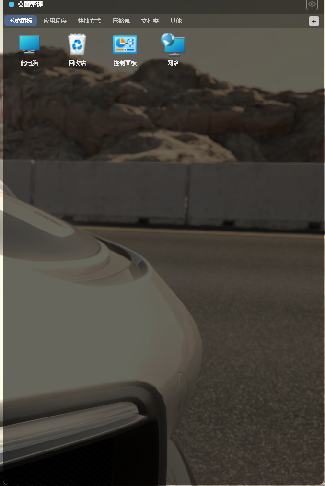

<div align="center">

# 🗂️ DesktopBox

**Free, portable Windows desktop organizer — your open-source [Fences](https://stardock.com/products/fences/) alternative.**

免费开源的 Windows 桌面整理工具 · 单文件绿色版 · 零联网零遥测


</div>

---

> 一键把桌面散乱文件按类型自动归类进**带标签页的盒子** —— **只引用、绝不移动文件**，其它程序照常工作。还能把程序/文件/文件夹/网址**拖进盒子**分类、**隐藏桌面图标**、用盒子存放**此电脑/回收站/控制面板/网络**等系统图标。

---

## 📑 Table of Contents · 目录

- [✨ Features · 功能](#-features--功能)
- [🖼️ Screenshots · 截图](#️-screenshots--截图)
- [📦 Download & Install · 下载安装](#-download--install--下载安装)
- [🚀 Usage · 使用](#-usage--使用)
- [🔨 Build from Source · 从源码编译](#-build-from-source--从源码编译)
- [🏗️ Architecture · 架构](#️-architecture--架构)
- [❓ FAQ · 常见问题](#-faq--常见问题)
- [🤝 Contributing · 参与贡献](#-contributing--参与贡献)
- [📄 License · 许可](#-license--许可)

---

## ✨ Features · 功能

**🇬🇧 English**

| | Feature |
|---|---|
| 🧹 | **One-click Tidy** — Scans your desktop and auto-sorts every file into a **tabbed box** (Apps / Documents / Images / Videos / Audio / Shortcuts / Archives / Folders / Other). **Incremental**: only new files on each run. |
| 📌 | **Reference-only, never moves** — The box stores *paths*, not copies. Your files stay exactly where they were. Scripts and shortcuts that hard-code desktop paths keep working. |
| 📦 | **Drag-drop boxes** — Create custom boxes anywhere, drag in apps/files/folders/URLs, double-click to open. 8-direction resize, edge-snap with hysteresis, multi-monitor clamp. |
| 🗂️ | **Tabbed boxes** — Convert/merge/split boxes into tabbed containers; reorder tabs by drag. |
| 👁️ | **Hide/Show desktop icons** — One toggle clears your real desktop icons (purely visual, no files touched). |
| 🖥️ | **System-icons box** — This PC / Recycle Bin / Control Panel / Network with **real system icons**. |
| 🖱️ | **Native shell context menu** — Real Windows right-click menu (Open / Properties / Send To / …) via a bundled C++ DLL. |
| ♻️ | **Green & portable** — A single ~71 MB exe. Config & icon cache live **next to the exe**; delete everything except the exe and it still runs and regenerates them. |
| 🔒 | **No telemetry, no network** — Never connects anywhere. |

**🇨🇳 中文**

| | 功能 |
|---|---|
| 🧹 | **一键整理** — 扫描桌面,按类型自动归类进**标签盒子**(应用程序/文档/图片/视频/音频/快捷方式/压缩包/文件夹/其他)。**增量**:每次只处理新文件。 |
| 📌 | **只引用、绝不移动** — 盒子存的是路径,不是副本。文件原地不动,写死桌面路径的脚本/快捷方式照常工作。 |
| 📦 | **拖放整理盒** — 任意位置建盒子,拖入程序/文件/文件夹/网址,双击打开。8 向缩放、带迟滞的贴边磁吸、多显示器边界限制。 |
| 🗂️ | **标签盒子** — 盒子可转标签盒子、合并/拆分,标签可拖动排序。 |
| 👁️ | **隐藏/显示桌面图标** — 一键清空桌面真实图标(纯视觉,不动文件)。 |
| 🖥️ | **系统图标盒子** — 此电脑/回收站/控制面板/网络,用**真实系统图标**。 |
| 🖱️ | **原生右键菜单** — 真正的 Windows 右键菜单(打开/属性/发送到/…),由配套 C++ DLL 提供。 |
| ♻️ | **绿色便携** — 单个 ~71MB 的 exe。配置与图标缓存放**exe 同目录**;删到只剩 exe 也能运行并自动重建。 |
| 🔒 | **零联网、零遥测** — 永不联网。 |

---

## 🖼️ Screenshots · 截图

> _Screenshots coming soon · 截图待补充_
>
> Add a desktop screenshot to `docs/screenshot.png`, then uncomment the image tag below.
> 把整理后的桌面截图放到 `docs/screenshot.png`,然后取消下面图片引用的注释。
>
> <!--  -->

---

## 📦 Download & Install · 下载安装

### For end users · 普通用户

Go to **[Releases](../../releases)** and grab one of:

前往 **[Releases 发布页](../../releases)** 下载:

| File · 文件 | 说明 |
|---|---|
| `DesktopBox.exe` | **绿色版**(推荐)· 双击即用,免安装,不写注册表 · 71 MB |
| `DesktopBox.ShellMenu.dll` | 原生右键菜单 DLL · 与 exe 放同目录(可选,缺则无原生菜单) |
| `DesktopBoxSetup.exe` | 安装包 · 一路 Next 即可(向导英文,软件本体中文) |

> ⚠️ **SmartScreen 提示?** → 点「更多信息 → 仍要运行」。本程序无数字签名,首次会有此提示,纯属正常。
> **SmartScreen warning?** → Click _More info → Run anyway_. (No code-signing certificate yet; this is expected.)

### Requirements · 运行环境

- **Windows 10 / 11 (64-bit)**
- 无需安装 .NET —— 绿色版已**自带运行时**(self-contained)。

---

## 🚀 Usage · 使用

**🇬🇧 Quick start**

1. **Launch** — A blue tray icon appears in the system tray.
2. **Create a box** — Right-click the desktop (or tray) → _New Box_.
3. **Add items** — **Drag** apps/files/folders/shortcuts/URLs onto a box.
4. **Open** — **Double-click** an icon.
5. **One-click tidy** — Right-click desktop → _One-click Tidy_ → all scattered files sorted into a tabbed box, **files stay put**.

**🇨🇳 快速上手**

1. **启动** — 右下角出现蓝色托盘图标。
2. **新建盒子** — 桌面空白处右键(或托盘右键)→「新建盒子」。
3. **放东西** — 把程序/文件/文件夹/快捷方式/网址**拖**到盒子上。
4. **打开** — **双击**图标。
5. **一键整理** — 桌面空白处右键 →「一键整理桌面」→ 散乱文件按类型归入标签盒子,**文件原地不动**。

📖 **Full guide · 完整文档:** [使用说明.md](使用说明.md)

---

## 🔨 Build from Source · 从源码编译

> This project has **no pre-built binaries in the repo** (they're git-ignored). Compile it yourself with the steps below.
> 仓库**不包含预编译产物**(已 gitignore),请用以下步骤自行编译。

### Prerequisites · 前置依赖

| Tool · 工具 | Version · 版本 | Purpose · 用途 |
|---|---|---|
| [.NET 8 SDK](https://dotnet.microsoft.com/download) | 8.0+ | 主程序 (C# / WPF) |
| [MSVC Build Tools](https://visualstudio.microsoft.com/visual-cpp-build-tools/) 或 Visual Studio | 17.x (含 C++ + Windows SDK) | 编译原生右键菜单 DLL (C++) |
| [Inno Setup](https://jrsoftware.org/isdl.php) _(可选)_ | 6.x | 打安装包 |

Verify · 验证:

```bash
dotnet --version        # 需 8.0+
git --version
# C++ 工具链: 在 "Developer Command Prompt for VS" 里
where cl                # 应能找到 cl.exe
```

### 1️⃣ Clone · 克隆

```bash
git clone https://github.com/kof2000git/desktop_box.git
cd desktop_box
```

### 2️⃣ Build & test · 编译并测试

```bash
# 编译整个解决方案
dotnet build DesktopBox.sln -c Release

# 运行单元测试 (21 项)
dotnet test DesktopBox.sln
```

### 3️⃣ Publish single-file exe · 发布单文件绿色版

```bash
dotnet publish src/DesktopBox/DesktopBox.csproj \
  -c Release \
  -r win-x64 \
  --self-contained true \
  -p:PublishSingleFile=true \
  -p:IncludeNativeLibrariesForSelfExtract=true \
  -p:EnableCompressionInSingleFile=true \
  -o publish
```

This produces a **single ~71 MB `publish/DesktopBox.exe`** with the entire .NET runtime + WPF bundled inside.

产出**单个 ~71MB 的 `publish/DesktopBox.exe`**,内含完整 .NET 运行时 + WPF。

### 4️⃣ Build the native shell-menu DLL · 编译原生右键菜单 DLL

The right-click shell menu is a small C++ DLL (`DesktopBox.ShellMenu.dll`). Build it from a **`x64 Native Tools Command Prompt for VS`** (so `cl.exe` is on PATH):

右键菜单是一个小型 C++ DLL,需在 **「x64 本机工具命令提示符」** 中编译(保证 `cl.exe` 在 PATH):

```bat
cd src\DesktopBox.ShellMenu
build_dll.bat
```

This drops `DesktopBox.ShellMenu.dll` into the `publish\` folder. Place it **next to** `DesktopBox.exe`.

> 💡 **Without this DLL** the app still runs fine — right-click just falls back to no native menu (it's wrapped in try/catch). For full functionality, ship both files.
> 💡 **没有这个 DLL 程序照常运行**,只是右键没有原生菜单(代码有 try/catch 兜底)。要完整功能,两个文件一起分发。

### 5️⃣ (Optional) Build installer · 打安装包

```bat
"C:\Program Files (x86)\Inno Setup 6\ISCC.exe" DesktopBox.iss
```

→ produces `release\DesktopBoxSetup.exe`

---

## 🏗️ Architecture · 架构

```
src/
├── DesktopBox/              # Main app (C# / WPF / .NET 8)
│   ├── Models/              # Box, BoxItem, AppConfig, AppPaths …
│   ├── Services/            # Persistence, IconExtractor, Organize,
│   │                        #   DesktopLayer, DesktopIcons, Theme, …
│   ├── ViewModels/          # MVVM (CommunityToolkit.Mvvm)
│   ├── Views/ & Controls/   # MainWindow, BoxControl, ItemTile …
│   └── Native/              # P/Invoke: Shell32, User32, IImageList …
├── DesktopBox.ShellMenu/    # Native C++ DLL — IContextMenu host
│   ├── DesktopBox.ShellMenu.cpp
│   └── build_dll.bat
└── DesktopBox.Tests/        # xUnit — 21 tests
```

**Key design decisions · 关键设计**

- **Desktop-layer window** — The main window reparents to the `WorkerW` desktop layer so it sits beneath browser windows yet above the desktop wallpaper (won't steal focus, won't block other apps). Falls back to a normal non-topmost window if reparenting fails.
- **Reference-only organize** — Tidying never calls `File.Move`; boxes store paths. Zero risk of "lost files".
- **Portable data** — All config (`boxes.json`, `organize.json`) and icon cache live next to the exe via `AppContext.BaseDirectory`. Truly green/portable.
- **Service-layer interfaces + unit tests** — Core logic (categorize, organize, persistence) is fully testable; Native/UI layers are manually verified.

**Tech stack · 技术栈:** .NET 8 · WPF · [WPF-UI](https://github.com/lepoco/wpfui) · CommunityToolkit.Mvvm · WinForms interop · C++/Win32 (shell menu)

---

## ❓ FAQ · 常见问题

**Q: Did one-click tidy move my files? / 一键整理会移动我的文件吗?**
**No. / 不会。** It only stores file *paths* in a box. Files stay exactly where they were.
只把文件**路径**存进盒子,文件原地不动。

**Q: Where is my data? / 我的数据在哪?**
Next to the exe: `boxes.json` (box layout), `organize.json` (tidy manifest), `icons/` (icon cache, auto-rebuilt), `logs/` (error log).
在 exe 同目录:`boxes.json`(盒子布局)、`organize.json`(整理清单)、`icons/`(图标缓存,可重建)、`logs/`(错误日志)。

**Q: Back up? / 怎么备份?**
Copy `boxes.json`. That's it.
复制 `boxes.json` 即可。

**Q: I deleted everything except the exe — will it still run? / 只剩 exe 还能运行吗?**
**Yes. / 能。** It regenerates config, icon cache and logs automatically next to the exe.
会自动在 exe 旁重建配置、图标缓存和日志。

**Q: Does it send any data online? / 会联网上传数据吗?**
**Never. / 绝不。** No telemetry, no network calls of any kind.
零遥测、零联网。

📖 More in [使用说明.md](使用说明.md#十常见问题).

---

## 🤝 Contributing · 参与贡献

Contributions are welcome! · 欢迎贡献!

- 🐛 **Bugs** — Open an [issue](../../issues) with steps to reproduce + `logs/error.log`.
- 💡 **Ideas** — Multi-monitor, URL icons, box search, collapsible boxes …
- 🌍 **i18n** — Help translate the UI.
- ⭐ **Star it** if it helps you!

- 🐛 **Bug** — 提 [issue](../../issues),附复现步骤 + `logs/error.log`。
- 💡 **建议** — 多屏支持、网址图标、盒子搜索、折叠盒子 …
- 🌍 **国际化** — 帮助翻译界面。
- ⭐ 觉得有用就**点个 Star**!

---

## 📄 License · 许可

[MIT](LICENSE) © kof2000git

> DesktopBox is an independent project. It is not affiliated with, endorsed by, or derived from Stardock Fences.
> DesktopBox 是独立项目,与 Stardock Fences 无任何关联。

<div align="center">

**⭐ If this project helps you, please give it a star! / 如果对你有帮助,请点个 Star! ⭐**

</div>
